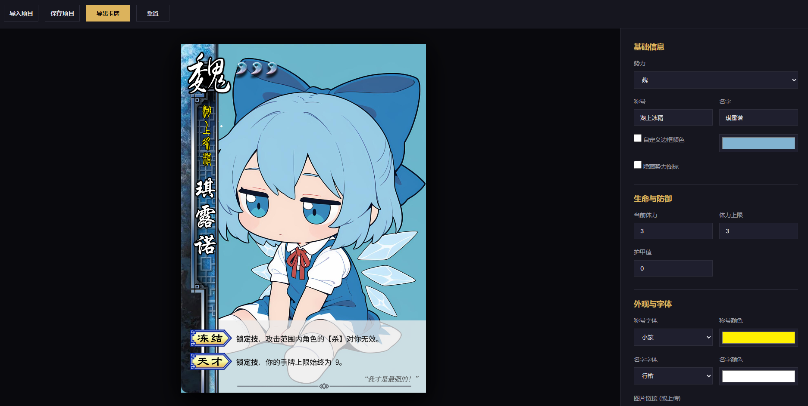

# 三国杀卡牌编辑器 (SGS Card Editor)

## 项目用途

本项目是一个基于 Web 技术的卡牌制作工具，专门用于设计和定制三国杀风格的角色卡牌。用户可以通过图形化界面实时调整卡牌的各项参数，包括武将姓名、称号、势力、体力值、护甲以及技能描述等。工具支持高自由度的布局微调，并能直接预览和导出生成的卡牌图像，适用于卡牌游戏爱好者进行二次创作、DIY 扩展包开发或游戏原型设计。

## 实现方案

系统基于原生 Web 技术开发，不依赖沉重的第三方框架，确保了轻量化与运行效率：

1. 核心渲染：使用 HTML5 Canvas API 进行像素级绘制。通过 RENDER_SCALE 缩放技术，在保证预览流畅的同时，能够输出高分辨率的成品图像。
2. 动态布局系统：
    - 技能区域实现了自动感应高度算法，系统会依据技能数量与描述文本长度自动计算并调整区域高度，同时动态适配字体大小与行间距。
    - 组件解构：将称号、姓名、势力、体力槽等元素彻底解构为独立组件。每个组件均拥有独立的坐标系、旋转角度及缩放参数。
    - 体力槽自适应：针对高体力数值进行了优化。当体力与护甲总数在常规范围内时逐个显示图标；当数值过大时，自动切换为“图标 x 数字”的紧凑排版格式。
3. 图像处理与色彩定制：
    - 边框着色：采用离屏画布技术，通过 multiply 混合模式将自定义颜色叠加至灰度模板上，在改变色调的同时完美保留原始素材的金属或木质纹理。
    - 像素级替换：对于技能标签等矢量风格素材，通过扫描像素点并在预设阈值内替换黑色像素的方法，实现了精准的色彩定制，避免了传统滤镜带来的边缘溢色问题。
4. 交互体验：
    - 响应式控制面板：通过实时监听输入变化触发重绘，提供零延迟的编辑反馈。
    - 画布交互：支持鼠标拖拽组件位置、滚轮缩放画布以及键盘微调等操作。
    - 数据持久化：支持将设计方案导出为 JSON 配置文件，并可随时重新导入继续编辑。
